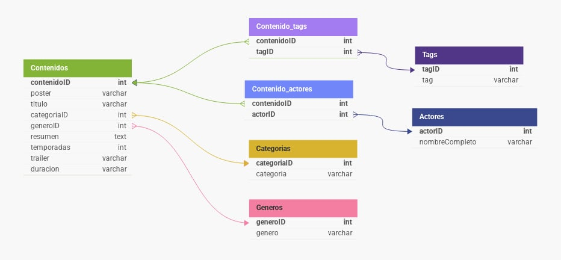

# 🎬 TrailerFlix API

¡Bienvenido a **TrailerFlix_Final**! Este proyecto es una API RESTful diseñada para gestionar información de películas y series, similar a una plataforma de streaming. Permite consultar, crear, actualizar y eliminar datos de contenidos, géneros, categorías, tags y actores.

---

## 📦 Tecnologías utilizadas

- **Node.js** + **Express** – Backend y enrutamiento
- **Sequelize** – ORM para MySQL
- **MySQL** – Base de datos relacional
- **dotenv** – Variables de entorno
- **CORS** – Acceso entre dominios

---

## 🚀 Instalación

1. Cloná este repositorio:

```bash
    git clone https://github.com/Shadow-Itzal/TrailerFlix_Final.git
    cd TrailerFlix_Final
```

2. Instalá dependencias:

```bash
    npm install
```

3. Configurá las variables de entorno:

Copiá el archivo `.env.example` y renombralo a `.env`. Completá con tus datos de conexión:

```
    DB_HOST=localhost
    DB_PORT=3306
    DB_NAME=trailerflix
    DB_USER=root
    DB_PASSWORD=<tu-contraseña-de-MySQL>
    DB_DIALECT=mysql
```

4. Iniciá el servidor:

```bash
    npm start
```

El servidor quedará activo en:  
👉 `http://localhost:3006/`

---

## 📁 Estructura del proyecto

```
TrailerFlix_Final/
|
├── img/
|    └── DER_TrailerFlix.jpg
|
├── ParaWorkbench/
|        ├── 01-BD.sql
|        ├── 02-categorias.sql
|        ├── 03-generos.sql
|        ├── 04-tags.sql
|        ├── 05-actores.sql
|        ├── 06-contenidos.sql
|        ├── 07-contenido-actores.sql
|        ├── 08-contenido-tags.sql
|        ├── Parte-2_consultas.sql
|        └── Trailerflix_arreglado.json
|
├── src/
|    ├── config/
|    |       └── database.js
|    |
|    ├── models/
|    |       ├── actor.js
|    |       ├── categoria.js
|    |       ├── contenido.js
|    |       ├── genero.js
|    |       ├── index.js
|    |       └── tag.js
|    | 
|    └── routes/
|        ├── actores/
|        ├── categorias/
|        ├── contenido_actores/
|        ├── contenido_tags/
|        ├── contenidos/
|        ├── generos/
|        └── tags/
|
├── .env.example
|
├── README.md
|
├── app.js
|
└── package.json
```

---

## 🌐 Endpoints disponibles

Cada entidad cuenta con sus rutas CRUD. Algunos ejemplos:

### Contenidos
```
    GET    /contenidos
    GET    /contenidos/:id
    GET    /contenidos/titulo/:titulo
    GET    /contenidos/tipo/:tipo
    POST   /contenidos
    PUT    /contenidos/:id
    DELETE /contenidos/:id
```

### Actores
```
    GET    /actores
    GET    /actores/:id
    GET    /actores/nombre/:nombre
    POST   /actores
    PUT    /actores/:id
    DELETE /actores/:id
```

### Categorías, Géneros, Tags, Relaciones...
También disponibles en carpetas correspondientes.

---

## 🧠 Consultas SQL avanzadas

Incluye el archivo [`Parte-2_consultas.sql`](./Parte-2_consultas.sql) con ejercicios prácticos como:

- Listar contenidos por género, categoría o tags
- Buscar por palabra clave en resumen o título
- Ranking de contenidos por calificación
- Actores con más participaciones
- Películas con más/menos actores

---

## 🗺️ Modelo Entidad-Relación



---

## 📌 Autores

**Shadow Itzal** y **anamarquez1408** 

Este proyecto fue desarrollado con fines educativos.

---

## 📄 Licencia

Uso libre para prácticas académicas o personales. No cuenta con una licencia específica.

---

## 🤝 Contribuciones

Las contribuciones son bienvenidas. Si tienes sugerencias, mejoras o encuentras errores, no dudes en abrir un *issue* o enviar un *pull request*.

---